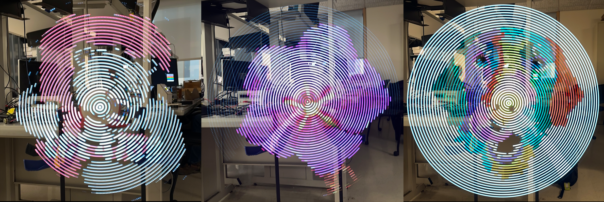

A persistence of vision display constructed from scratch using the Raspberry Pi Pico W microcontroller. Runs at 30 FPS with full RGB color and streams images over wifi.

Created by: Michael Crum (mmc323@cornell.edu), Joseph Horwitz (jah569@cornell.edu), Rabail Makhdoom (rm857@cornell.edu)

Project Introduction (*One sentence "sound bite" that describes your project. A summary of what you did and why.*)

# Project Introduction

We built a persistance of vision display which can create any image with a rotating strip of LEDs.

A persistence of vision (POV) refers to the phenomenon of the human eye in which an image exists for a brief time (10 ms). It is an optical illusion in which a visual image seems to persist even when the light from it ceases to enter our eyes. Our POV display exploits this phenomena by spinning a one dimensional row of 40 LED's at such a high frequency that a two dimensional display is visible. By ensuring that the rotational speed of the LED's is fast enough, we can trasnmit images over Wifi and display them on our system such that the human eye perceives a complete two dimensional image. 

The overall design of this project can be grouped into three categories: mechanical, electrical, and software design. A spinning arm consisting of 40 light emitting diodes (LEDs) as well as a mounting station for the motor and PCBs make up the mechanical components. On the electrical end, we used multiple components: an H-bridge motor driver and Pi Pico was used to run the motor, a Pico W tranmit images to our system, a hall sensor detected the time period of each arm rotation, and an inductive supply powered up all the required components. The actual algorithm to send images over Wifi using TCP and to display them on the LEDs was implemented in C and Python.

High level design
* *Rationale and sources of your project idea*
* *background math*
* *logical structure*
* *hardware/software tradeoffs*
* *Discuss existing patents, copyrights, and trademarks which are relevant toyour project.*

# High Level Design

The original idea for this project came from a video that Rabail saw of a similar POV display on Youtube.com. We approached our professor, Hunter Adams, to discuss whether this would actually be a viable project idea and on his confirmation we started brainstorming about the POV display. Initially, we thought of implementing the display on a propeller fan as we had seen on Youtube, but eventually we chose to build the rotor and arm of the POV display ourselves for a cleaner and more lightweight project. 

To display an image, we first convert a bitmap image to a polar coordinate system, where we define a theoretical "pixel" to be the image's color at a certain radius from the center of the image at a certain angle. The resolution of the image in this system is determined by the number of LEDs we can use (radius) and how many times we can change the LEDs in one rotation (angle). 

The logical structure of our project is relatively straightforward. First, we  Our software calculates the time duration to display each "pixel" on the display by simply measuring the period of each full rotation using a Hall Effect sensor and a magnet, then dividing by the number of rotation angles we sampled from the source image. By assigning the LEDs to a certain color for just that duration of time, we can then display the pixels and ensure proper image orientation at each rotation.

The nature of our design allows the hardware and software tradeoffs to be independent of each other. The more robust we make our software (i.e. optimized code, error-free LED mapping), the more optimized and error free our project becomes. Similarly, by making our hardware more robust (i.e. using heat sinks, tying down wires, using bigger motors), we get a higher resolution of our system and also make the project safer. 

Our project does not include any known existing patents, copyrights, or trademarks. We designed all the hardware from scratch. The software is also our original work, with some basis in the open-source example code published by Raspberry Pi.

Program/hardware design
* *program details. What parts were tricky to write?*
* *hardware details. Could someone else build this based on what you have written?*
* *Be sure to specifically reference any design or code you used from someone else.*
* *Things you tried which did not work*

# Design Details

## Software

Our program had several steps. First, we developed a Python script to converted bitmap images into a custom, polar coordinate data format which could be used to display images on the POV display. Then, we established a TCP exchange to transfer the processed image data to the microcontroller which operates the display. We based this code on the open-source TCP examples provided by Raspberry Pi for the Pico W. Wifi was our chosen communication method because it allowed us to update the image while the microcontroller was rotating, which would be impossible with a wired setup. On the microcontroller's side, we had one thread poll for incoming data and handle processing that data, while another thread maintained the display. The data came through as a stream of bytes but had to be formed into a three-dimensional array of color data: angle of rotation * LED number (0 at center) * RGB triple. This structure made displaying the image a simple continuous loop through the array, where all the LEDs are simultaneously updated at a period matching the frequency of the blade's rotation. The main challenge in the program for displaying the image was in timing. The thread to change the LEDs had to run exactly as quickly as needed to loop through the entire image during one spin of the blade. This was accomplished by timing one rotational period using a hall effect sensor and magnet. A hall effect sensor attached to the spinning microcontroller would trigger an interrupt every time it passed a magnet fastened to a stationary base. By timing the interrupts and dividing by the target number of rotations, the timing of LED changes could be adjusted on the fly to guarantee a complete and steady image.

### Python

### Device Drivers

#### APA102 LEDs

The APA102 LEDs use a two wire SPI protocol to communicate with the PI Pico. This allows us to use RP2040's SPI peripheral, which made writing the driver easy. The LEDs expect packets that are broken into "frames" of 32 bits. Each message begins with a start frame of 32 0's, and end with an end frame of 32 1's. In between, each frame represents the data for a single LED in the strip. A LED frame starts with 111, then is followed by five bits representing the brightness of the LED. This is followed by 8 bits for each of blue, green, and red, giving 256 values for each.

Below is our code for constructing the packets based on a three dimensional array representing the color of each LED on the strip.

**add code**

The LEDs are wired in series, with the SCK and MOSI lines of the previous LED leading into the next. When an LED receives a packet, it updates its state, strips the first LED frame off the packet, and then shifts the new packet out of its output SCK and MOSI lines. By doing so ,the entire strip can be updated from a single message sent to the first LED in the strip.

### Pico Entry Point

## Electrical

In a system experiencing high accelerations, Printed Circuit Boards (PCB's) are king. Made from high strength PTFE substrate, these boards can stand many thousands of G's, and soldered connections are extremely resilient to the characteristic forces of a POV display. They are also light weight and slightly flexible, making them even more suitable for our use case. We decided to create two PCB's for our design.

The first is what we call the "Arm". The arm holds 40 surface mounted APA102 LED's and provides standard 0.1 inch headers for interfacing with the LEDs. We added a M3 sided hole on each end of the arm, which allowed us mount the PCB and screw on nuts and ballance the weight of the rotor. The APA102 LEDs were chosen because they use a two wire SPI protocol to communicate with the control board. This allows communication rates of up to 20 MHz, more than fast enough for our application. We previously experimented with the popular WS2812B LEDs, but these LEDs capped at around 1 KHz refresh rate. This would limit the radial resolution of our display.

The second PCB is the control board. The control board holds the Pico W and the power / logic electronics to facilitate communication with the LEDs and hall effect sensor. The Pico W uses 3.3v logic levels, which can cause trouble with the APA102 LEDs, which expect 5v logic. To remedy this we included a 74LVC245 Logic Level shifter. This shifter converts our 3.3v signal to 5v, and is fast enough to deal with our high speed (20 MHz) SPI signals. To power the control board we use a screw terminal to accept power. A 47 uF decoupling capacitor is placed across the power supply, which is especially important when dealing with the rapidly changing power requirements of the LEDs. We also added a Schottky diode before routing the power into the Pico's VSYS pin. This diode allows the board to take power from other the screw terminals and the Pico's onboard USB without connecting 5v rails (which would damage both the Pico and the power supply). To allow for ease of programming we connected a push button between RUN and ground, allowing for the double tap into bootselect capability of the Pico to be reached. Finally, we wired the hall effect sensor to pin 21 of the Pico with a 10k pull up resistor. The sensor is active low.

All PCB's were designed using KiCad, an open source ECAD software. Project files are included in our GitHub Repo, linked in appendix B.

One of the key design choices of a POV display is how to power the rotor. Because of its rapid motion, wires would get tangled if ran between the mount and the rotor. This leaves three options: a slip ring, an onboard battery, and an inductive power supply. Slip rings are notoriously unreliable, cause sparks under high load, wears over time, and adds friction. An onboard battery adds weight to the rotor and is a safety concern (imagine an overheating LiPo traveling at 120 miles per hour, not so fun). We decided to use an inductive power supply as it has minimal effect on the mechanical design of the system, allows for wireless and frictionless power transmission, and is by far the "slickest" solution, if that matters (it does).

Due to the adoption of wireless charging technology in mobile phones, high efficiency and inductive coils are readily available an amazon. We picked up a 25$ system that is capable of transmitting 2A of current at 5v across up to 80 mm, more than enough for our application.

Finally, we need to spin the rotor. We initially used cheap and small brushed DC motors. You are probably familiar with these motors, they are the small gray ones that come with about every hobby electronics kit ever made. Because we took care to ballance our rotor and minimize its weight, we predicted that the motor would have very low load. We thought this meant we could get away with a wimpy motor without issues. We were unfortunately wrong, for reasons that aren't entirely clear. Our motors would overheat and burn up, which drawing only about 2A of current. We theorize that this was caused either by air resistance generating a much higher load than we predicted or from an interaction with the inductive power supply. The motor was positioned directly in the center of the inductive coil, and may have induced current in the motor coils that decreased performance.

We were able to locate a much stronger motor in the lab, which ended up being better for the application. At only 6v it reached 1800 RPM, which equates to 30 fps in POV terms (our target speed). This motor is powered by a motor speed controller built from a second PI Pico and a two channel HBridge. We tied the channels of the HBridge together to increase the max current from 1.5 A to 3 A, which worked great for our application. The speed of the controller is determined by the position of a potentiometer, allowing use to tune the display and test which speeds looked the best to the eye.

## Mechanical

We started the design process by working on the rotor. As mentioned in the previous section, the PCBs themselves were included in the mechanical construction of the rotor. To supplement the PCBs, we needed to create a super structure that holds the PCBs together and connects them to the motor shaft. Additionally, we needed a mount for the inductive coil. Along with the functional requirements, we want to keep weight to a minimum and make the design modular so that design iterations are faster.

Our design is 3D printed with minimal infill to reduce weight. It is only a couple of millimeters thick, and is designed to use the PCBs to supplement its strength. Components are connected using M3 screws that are threaded directly into the PLA. With proper print settings, these connections are remarkably strong, and more than strong enough for the mostly lateral load in this application.

The rotor is connected to an adaptor that fits the motor shaft on one end and has a standard hole pattern on the other side. By making the adaptor a separate component, the entire rotor doesn't have to be reprinted when we change the motor. The adaptor includes a hole for a set screw, but the press fit ended up being sufficient. By adding a bolt and nuts to the hole at the end of the arm PCB, the rotor can be balanced. This reduces load on the motor and mitigates vibrations.

The next step was creating a housing for the motor. The housing must include a way to secure the inductive coil at a proper distance from the rotor, secure the motor and minimize vibrations, and make it easy to attach the system to a table for testing.

After many tests and iterations, we landed on the motor mount design above. The motor and inductive coil are mounted together using the circular middle section. The cut out supports the motor and prevents it from rotating. The inductive coil is mounted in the indent, and the 13 mm of plastic facing the rotor guarantees the the minimum coil spacing is respected. The circular section then fits into the table mount, and is secured using two M3 screws. The current table mount provides flat area for clamping to the table, but the entire mount could be redesigned for a wall or floor mount. Again, the two parts are modular to reduce redesign time. All parts are printed in PLA with 20% infill, which was plenty strong enough for the application. PLA is not ferromagnetic, which means that it does not interfere with the inductive power supply.

### Mechanical aside: Motor mistakes

One of our early designs used a series of belts to increase the speed of a 300 rpm motor up to 1800. This design repeatedly failed due to the 3D printed shafts shearing, so we ended up looking for a faster motor instead.

We initially tried using a much smaller motor, but scrapped it due to overheating. This design used a significantly different motor mount, which screwed into the back of the inductive coil mount.

Results of the design
* *Any and all test data, scope traces, waveforms, etc*
* *speed of execution (hesitation, filcker, interactiveness, concurrency)*
* *accuracy (numeric, music frequencies, video signal timing, etc)*
* *how you enforced safety in the design.*
* *usability by you and other people*

# Results of the Design

**TODO test data images**

In terms of time complexity, our constraint was maintaining high rotational resolution (LED changes per arm rotation) while operating the motor quickly enough to maintain the optical illusion of a continuous image. The time complexity of operating the display for a full rotation is proportional to the number of rotations * number of LEDs * 3 (3 is for RGB color). The three is for RGB color. We used 40 LEDs and found that 120 LED changes per rotation was sufficient for a high resolution image. Then we ran 14,400 color updates every arm rotation. Each update was a single byte SPI operation clocked at 20 MHz. Then, with no added delays, the arm could be operated at 0.72 ms per full rotation. This is significantly faster than necessary to maintain the persistance of vision illusion, so we were able to operate the display without flicker or hesitation. Additionally, the TCP interface for changing the display image was handled asynchronously on a separate core from the thread operating the display, so interaction did not cause timing issues.

The images generated had a resolution of 40 LEDs by 120 angles, so 480 "pixels". This number could have been increased by changing the number of angles, but the actual resolution of the image is constrained by the size and number of the LEDs so changing this parameter would have diminishing returns. As is, even complex images such as a photograph of our professor are recognizable, and text is legible as well.

## Safety

**TODO safety**

The POV display is easily usable. On the hardware side, the device has a single power supply originating from a wall outlet charger. It can be plugged in and ready to go anywhere. Then the motor speed is controlled by a potentiometer attached to its H-bridge power supply. FOr software, images can be communicated with an interactive Python script that accepts the name of any image in the folder labelled "pov_images" and communicates the processed image to the display. It also accepts several GIF names and automatically cycles through the images of the GIF to simulate movement.

Conclusions
* *Analyse your design in terms of how the results met your expectations. What might you do differently next time?*
* *How did your design conform to the applicable standards?*
* *Intellectual property considerations.*
    * *Did you reuse code or someone else's design? Did you use any of Altera's IP?*
    * *Did you use code in the public domain?*
    * *Are you reverse-engineering a design? How did you deal with patent/trademark issues?*
    * *Did you have to sign non-disclosure to get a sample part?*
    * *Are there patent opportunites for your project?*

# Conclusions

Our results met our expectations close to perfectly. The one element that we would like to improve is the GIF speed, which could be accomplished by increasing the polling frequency of our TCP thread on the Pico W operating the display. Otherwise, we are satisfied with our clear and stable holographic images.

# Appendicies

## Appendix A: Permissions

The group approves this report for inclusion on the course website.

The group approves the video for inclusion on the course youtube channel.

## Appendix B: Source Code

See a full source code listing at our [GitHub Repo](https://github.com/usedhondacivic/ECE-4760-final-project).

## Appendix C: Bill of Materials

## Appendix D: External Links and References

Technical Documentation:

* Data sheets
  * APA102 LEDS
  * Logic level converter
  * Hall effect sensor
  * PI PICO
    * hardware design guide
    * c sdk
    * RP 2040 reference
    * tcp schenanigans 

Sources of Inspiration: 
